# System Architecture

Last updated: 2026-06-27

## Three-Tier Architecture

The Personal OTP Vault follows a clean three-tier architecture where presentation, domain logic, and data storage are clearly separated.

```
┌─────────────────────────────────────────────────────────────┐
│                    Presentation Layer                        │
├──────────────────────────┬──────────────────────────────────┤
│  Root Web App            │  Chrome Extension                │
│  (index.html + app.js)   │  (extension/popup.html + popup.js)│
│                          │                                  │
│  - PWA UI                │  - Extension Popup UI            │
│  - Camera Scan           │  - BarcodeDetector Integration   │
│  - Offline Support       │  - Quick Access                  │
│  - localStorage          │  - chrome.storage.local          │
└──────────────────────────┴──────────────────────────────────┘
                             ↓ Shared
┌─────────────────────────────────────────────────────────────┐
│                      Domain Logic Layer                      │
│                     (lib/ modules)                           │
├──────────────────────────┬──────────────────────────────────┤
│  lib/otp.js              │  lib/vault.js                    │
│  - TOTP Generation       │  - Encryption/Decryption         │
│  - URI Parsing           │  - Key Derivation                │
│  - Entry Normalization   │  - Backup/Restore                 │
│  - Search/Sort           │  - Migration Logic                │
└──────────────────────────┴──────────────────────────────────┘
                             ↓ Abstracted
┌─────────────────────────────────────────────────────────────┐
│                    Storage Layer                             │
├──────────────────────────┬──────────────────────────────────┤
│  Browser localStorage     │  Chrome Storage API             │
│  (personal_otp_vault_*)  │  (otp_extension_*)               │
│                          │                                  │
│  - Entries (v2)          │  - Entries (v2)                 │
│  - Encrypted Vault (v1)  │  - Encrypted Vault (v1)          │
│  - Settings (v3)         │  - Settings (v1)                 │
└──────────────────────────┴──────────────────────────────────┘
```

## Storage Abstraction

### Root App Storage (localStorage)
The root web app uses browser localStorage with versioned keys:

```javascript
// Storage keys
localStorage.getItem('personal_otp_vault_entries_v2')
localStorage.getItem('personal_otp_vault_encrypted_v1')
localStorage.getItem('personal_otp_vault_settings_v3')
localStorage.getItem('personal_otp_vault_persist_warning_seen_v1')
```

### Extension Storage (chrome.storage.local)
The extension uses Chrome's storage API, which is async and quota-managed:

```javascript
// Storage keys
chrome.storage.local.get('otp_extension_entries_v2')
chrome.storage.local.get('otp_extension_encrypted_v1')
chrome.storage.local.get('otp_extension_settings_v1')
chrome.storage.local.get('otp_extension_ui_v1')
```

### Storage Interface Pattern
Both frontends implement the same logical operations but use different APIs:

```javascript
// Root app (synchronous)
const entries = JSON.parse(localStorage.getItem('personal_otp_vault_entries_v2') || '[]');

// Extension (asynchronous)
const result = await chrome.storage.local.get('otp_extension_entries_v2');
const entries = result.otp_extension_entries_v2 || [];
```

## Encryption Pipeline

The encryption system uses a multi-stage pipeline to derive keys and protect vault data.

### Key Derivation (PBKDF2)
```javascript
// lib/vault.js - PBKDF2 parameters
PBKDF2 iterations: 150,000
Hash algorithm: SHA-256
Salt length: 16 bytes (random)
Output key length: 256 bits (32 bytes)
```

### Encryption Process
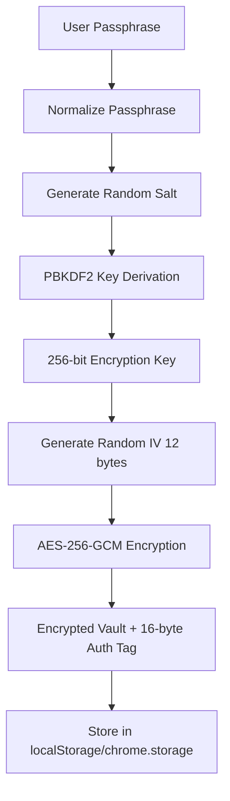

### Decryption Process
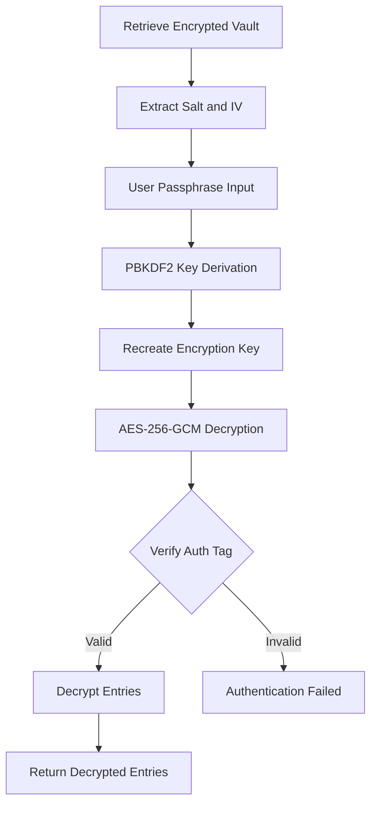

### Cryptographic Parameters (lib/vault.js)
```javascript
// AES-GCM configuration
Algorithm: AES-GCM
Key length: 256 bits
IV length: 12 bytes
Auth tag length: 16 bytes
```

## Data Flow Diagrams

### Entry Addition Flow
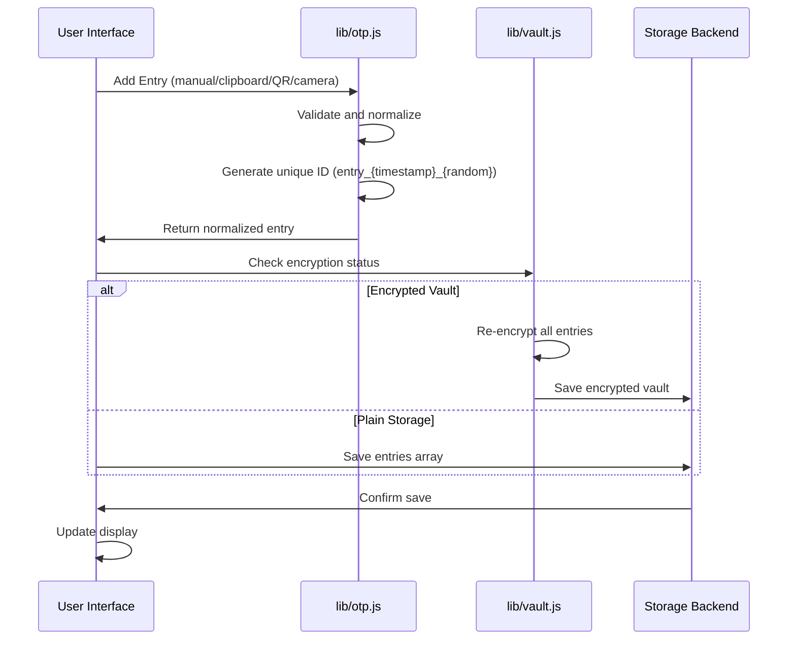

### TOTP Generation Flow
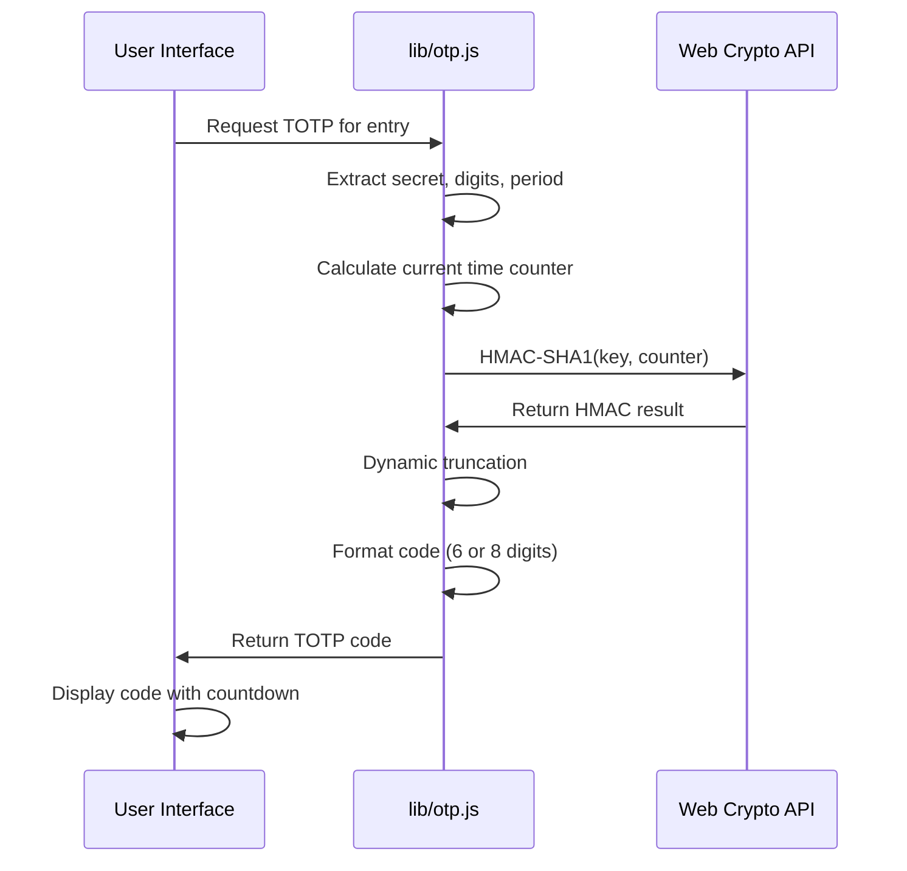

### Backup Export Flow
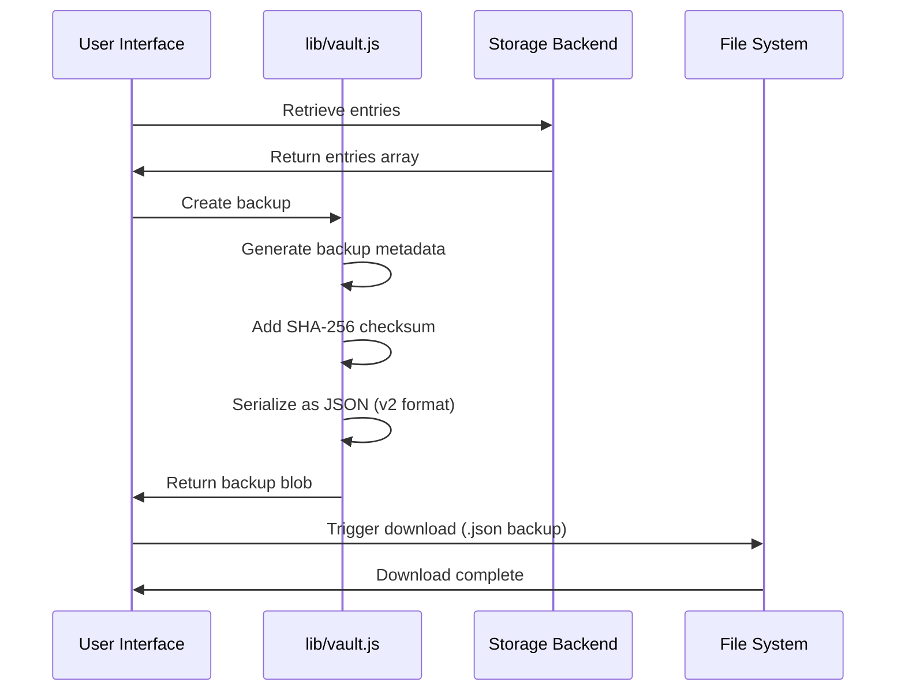

### Backup Import Flow
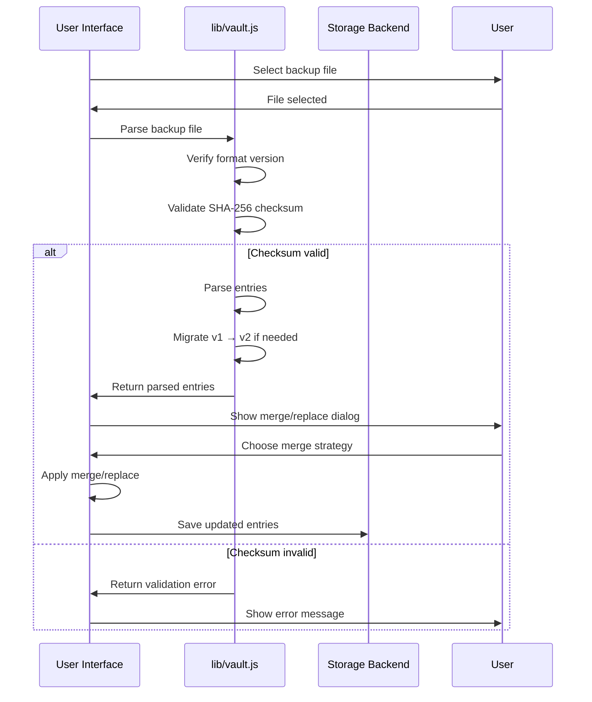

## Service Worker and Offline Architecture

### Service Worker Registration
```javascript
// sw.js - Service Worker Configuration
Cache name: otp-vault-cache-v3
Cached assets: index.html, app.bundle.js, styles.css, icons/
Strategy: Cache-first for static assets, network for updates
Offline fallback: Cached index.html
```

### PWA Installation Flow
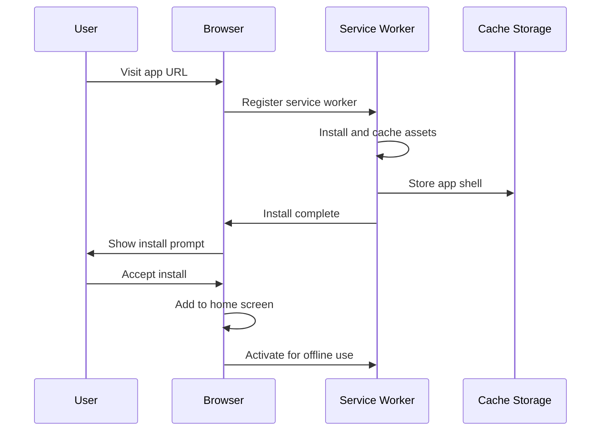

### Offline Operation
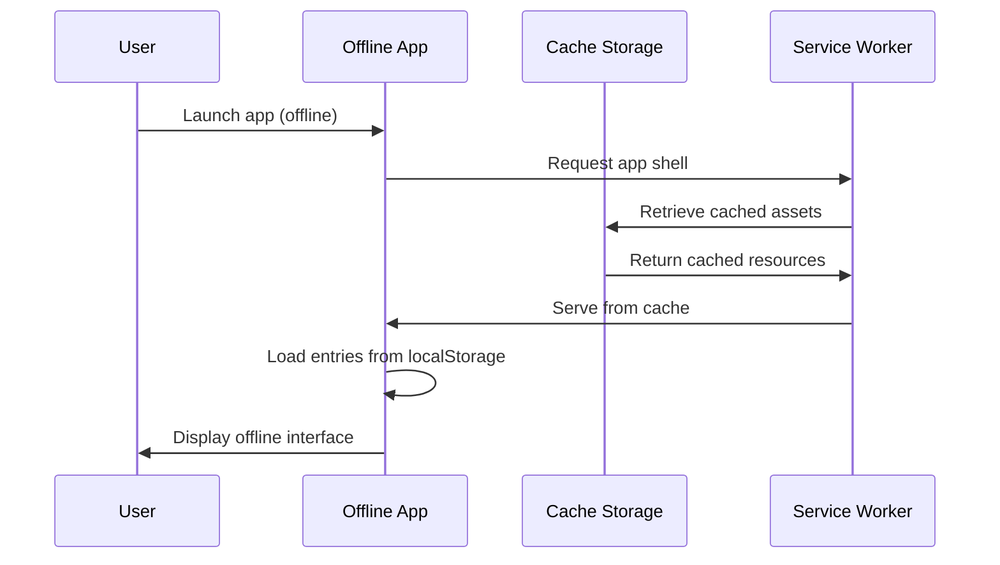

## Backup Format Versioning

### Version 2 Format (Current)
```json
{
  "version": 2,
  "exportedAt": "2026-06-27T10:30:00.000Z",
  "checksum": "sha256:abc123...",
  "entries": [
    {
      "id": "entry_1687854000_abc123",
      "issuer": "ExampleService",
      "account": "user@example.com",
      "secret": "JBSWY3DPEHPK3PXP",
      "algorithm": "SHA1",
      "digits": 6,
      "period": 30,
      "tags": ["personal", "important"]
    }
  ]
}
```

### Version 1 Migration
The system automatically detects and migrates v1 backups:
- **v1 checksum**: Simple MD5 hash (deprecated)
- **v2 checksum**: SHA-256 with prefix
- **Migration**: Automatic upgrade on import
- **Fallback**: Graceful error if migration fails

### Checksum Validation
```javascript
// lib/vault.js - Checksum verification
SHA-256(JSON.stringify(entries))
Format: "sha256:" + hex_digest
Purpose: Detect tampering and corruption
Validation: Mandatory before import
```

## Entry Render Loop

### Display Update Cycle
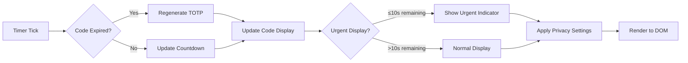

### Update Triggers
1. **Timer-based**: Every second for countdown updates
2. **Code regeneration**: When period expires
3. **User interaction**: Copy, pin, edit actions
4. **Data changes**: Add, remove, import operations
5. **View changes**: Group, sort, filter updates

## Storage Key Evolution

### Version Naming Convention
All storage keys follow the pattern: `{prefix}_{name}_v{version}`

### Root App Key Evolution
```
personal_otp_vault_entries_v1 (deprecated)
personal_otp_vault_entries_v2 (current)

personal_otp_vault_encrypted_v1 (current)

personal_otp_vault_settings_v1 (deprecated)
personal_otp_vault_settings_v2 (deprecated)
personal_otp_vault_settings_v3 (current)
```

### Extension Key Evolution
```
otp_extension_entries_v1 (deprecated)
otp_extension_entries_v2 (current)

otp_extension_encrypted_v1 (current)

otp_extension_settings_v1 (current)
otp_extension_ui_v1 (current)
```

## Extension Service Worker

### Background Script Role
```javascript
// extension/background.js - Minimal service worker
Purpose: Maintain extension context
Permissions: storage, clipboardRead
Lifecycle: Event-driven, not persistent
Interactions: Responds to popup messages
```

### Message Passing
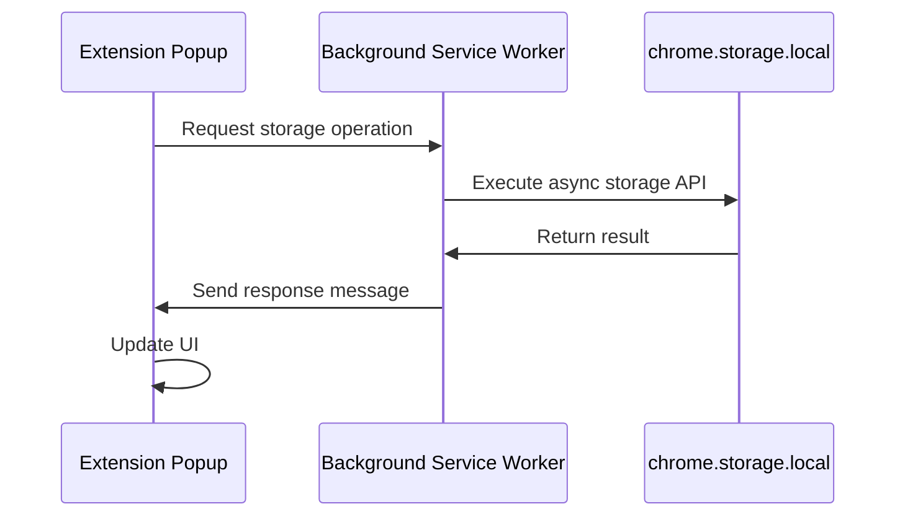

## Error Handling Architecture

### Crypto Error Handling
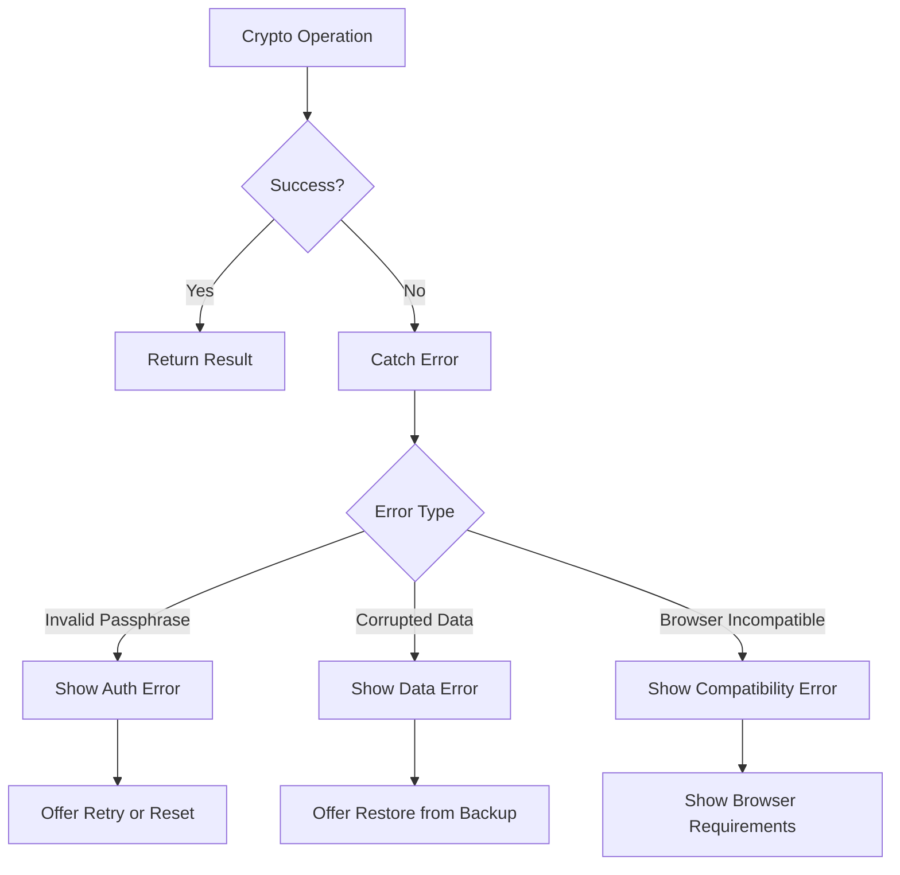

### Validation Error Handling
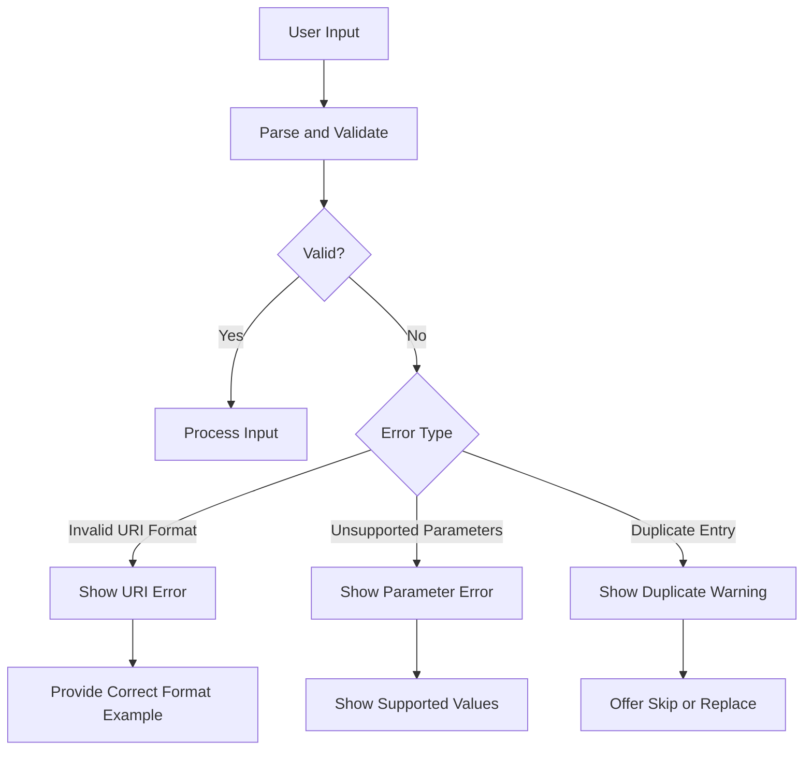

## Performance Considerations

### Caching Strategy
- **App shell**: Cache-first for instant loading
- **TOTP generation**: Computed on-demand, not cached
- **Entry display**: Virtual DOM updates for efficiency
- **Search indexing**: Pre-computed for fast filtering

### Memory Management
- **Entry limits**: No hard limit, but UI performance guides
- **Crypto operations**: Web Crypto uses native implementations
- **Service worker**: Controlled cache size with version management
- **Extension storage**: Chrome manages quota automatically

## Security Architecture

### Threat Model
- **Trusted device**: Assumes user controls their device
- **Local-only**: No network transmission of secrets
- **Encryption optional**: Users choose security vs convenience
- **Backup safety**: Checksum validation prevents tampering

### Security Boundaries
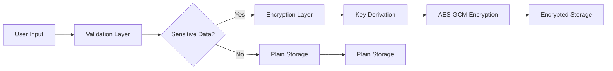

### Web Crypto Usage
- **No external crypto**: Only Web Crypto API
- **Browser native**: Uses browser's crypto implementations
- **Proper algorithms**: Follows current best practices
- **Fallback handling**: Graceful degradation if unsupported

## Integration Points

### Root App Integrations
- **PWA install**: Uses browser install prompts
- **Camera access**: Requests permissions for QR scanning
- **File system**: Backup export/import via downloads
- **Clipboard**: Read/write for code copying and URI import

### Extension Integrations
- **Chrome storage**: Async storage API with quota management
- **BarcodeDetector**: For QR code parsing in extension
- **Clipboard API**: Same as web app for consistency
- **Extension pages**: Popup and background service worker

This architecture enables the Personal OTP Vault to function as both a full-featured PWA and a lightweight browser extension while sharing core domain logic and maintaining clear separation of concerns.
