# System Architecture

Last updated: 2026-10-08

## Three-Tier Architecture

The Personal OTP Vault follows a clean three-tier architecture where presentation, domain logic, and data storage are clearly separated.

```
┌─────────────────────────────────────────────────────────────┐
│                    Presentation Layer                        │
├──────────────────────────┬──────────────────────────────────┤
│  Root Web App            │  Chrome Extension                │
│  (index.html + app.js)   │  (extension/popup.html + popup.js)│
│                          │                                  │
│  - PWA UI                │  - Extension Popup UI            │
│  - Camera Scan           │  - BarcodeDetector Integration   │
│  - Offline Support       │  - Quick Access                  │
│  - localStorage          │  - chrome.storage.local          │
└──────────────────────────┴──────────────────────────────────┘
                             ↓ Shared
┌─────────────────────────────────────────────────────────────┐
│                      Domain Logic Layer                      │
│                     (lib/ modules)                           │
├──────────────────────────┬──────────────────────────────────┤
│  lib/otp.js              │  lib/vault.js                    │
│  - TOTP/HOTP Generation  │  - Encryption/Decryption         │
│  - URI Parsing           │  - Key Derivation                │
│  - Entry Normalization   │  - Backup/Restore                 │
│  - Search/Sort           │  - Migration Logic                │
└──────────────────────────┴──────────────────────────────────┘
                             ↓ Abstracted
┌─────────────────────────────────────────────────────────────┐
│                    Storage Layer                             │
├──────────────────────────┬──────────────────────────────────┤
│  Browser localStorage     │  Chrome Storage API             │
│  (personal_otp_vault_*)  │  (otp_extension_*)               │
│                          │                                  │
│  - Entries (v3)          │  - Entries (v3)                 │
│  - Encrypted Vault (v1)  │  - Encrypted Vault (v1)          │
│  - Settings (v3)         │  - Settings (v1)                 │
└──────────────────────────┴──────────────────────────────────┘
```

## Storage Abstraction

### Root App Storage (localStorage)
The root web app uses browser localStorage with versioned keys following the
`{prefix}_{name}_v{version}` pattern; the constants are defined at the top of
`app.js`. The authoritative key inventory lives in
[Storage Key Evolution](#storage-key-evolution) below.

### Extension Storage (chrome.storage.local)
The extension uses Chrome's storage API, which is async and quota-managed.
The constants are defined at the top of `extension/popup.js`; see
[Storage Key Evolution](#storage-key-evolution) below for the inventory.

### Storage Interface Pattern
Both frontends implement the same logical operations but use different APIs.
Root app reads go through `normalizeEntries` in `app.js`; extension reads go
through `initialize` in `extension/popup.js`.

```javascript
// Root app (synchronous)
const entries = normalizeEntries(JSON.parse(localStorage.getItem('personal_otp_vault_entries_v3') || '[]'));

// Extension (asynchronous)
const result = await chrome.storage.local.get('otp_extension_entries_v3');
const entries = normalizeEntries(result.otp_extension_entries_v3 || []);
```

## Encryption Pipeline

The encryption system uses a multi-stage pipeline to derive keys and protect vault data.

### Key Derivation (PBKDF2)
```javascript
// lib/vault.js - PBKDF2 parameters (Phase 1 envelope)
Default iterations: 600,000 (KDF_PARAMS_DEFAULT)
Legacy floor iterations: 150,000 (KDF_PARAMS_LEGACY)
Hash algorithm: SHA-256
Salt length: 16 bytes (random)
Output key length: 256 bits (32 bytes)
```

The PBKDF2 parameters are stored INSIDE the encrypted envelope's `kdf` block
(`{algorithm, iterations, hash, saltBytes}`), so parameters can evolve without
a format break. A sub-floor `kdf` block is treated as legacy and silently
re-encrypted at the current default right after a successful unlock (once per
payload hash, guarded by a sessionStorage sentinel so concurrent tabs do not
stampede). Consequence: vaults re-encrypted after 0.1.2 cannot be read by
older app versions.

### DEK Two-Envelope Mode (biometric unlock, Phase 6)
When biometric unlock is enrolled, the vault switches to a two-envelope
design. Vault data is encrypted under a random 256-bit Data Encryption Key
(DEK). The DEK is wrapped twice: once under the passphrase-derived key (the
envelope's `dek: {wrapped, iv}` block, recovery) and once under an HKDF-SHA256
KEK derived from the WebAuthn PRF output (stored wrapped in a separate
biometric record: `{credentialId, prfSalt, wrappedDek, wrappedIv}`). The
envelope carries the `kdf.mode: "dek-v1"` marker so pre-0.1.5 code reports a
clear "newer format" error instead of a misleading passphrase error.

Key properties:
- The passphrase path always remains: it unwraps the DEK from the envelope
  and decrypts the data, with or without the authenticator.
- Mutations re-encrypt the data under the held DEK (stable salt and wraps).
- Backup export always re-encrypts under the passphrase key into the standard
  envelope (no `dek` block), so backups restore by passphrase alone on any
  version. Only a LIVE biometric-mode vault requires 0.1.5+ code.
- Enrollment is a two-store write (envelope first, biometric record second);
  an orphaned record with no `dek` block is deleted at unlock (self-healing).
- PRF output, KEK, DEK, and passphrases are never persisted or logged.

### Encryption Process
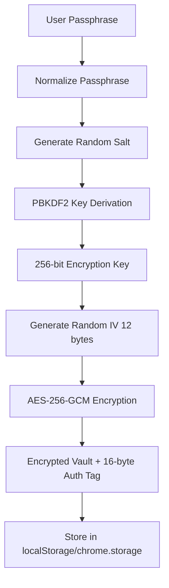

### Decryption Process
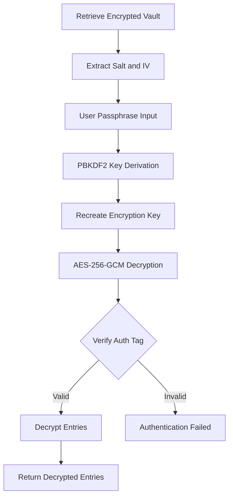

### Cryptographic Parameters (lib/vault.js)
```javascript
// AES-GCM configuration
Algorithm: AES-GCM
Key length: 256 bits
IV length: 12 bytes
Auth tag length: 16 bytes
```

## Data Flow Diagrams

### Entry Addition Flow
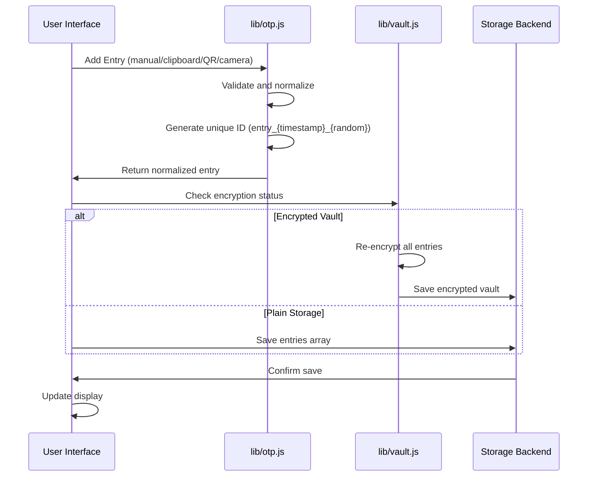

### TOTP Generation Flow
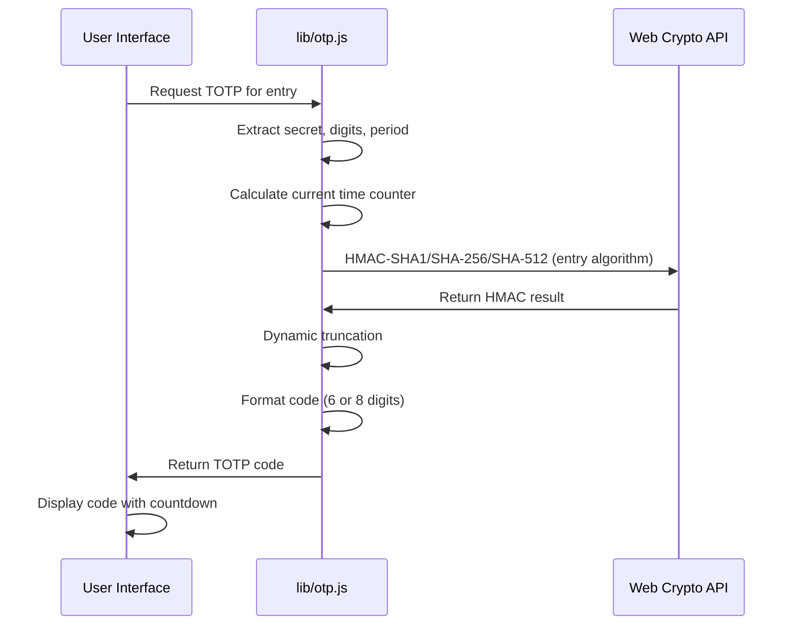

### Backup Export Flow
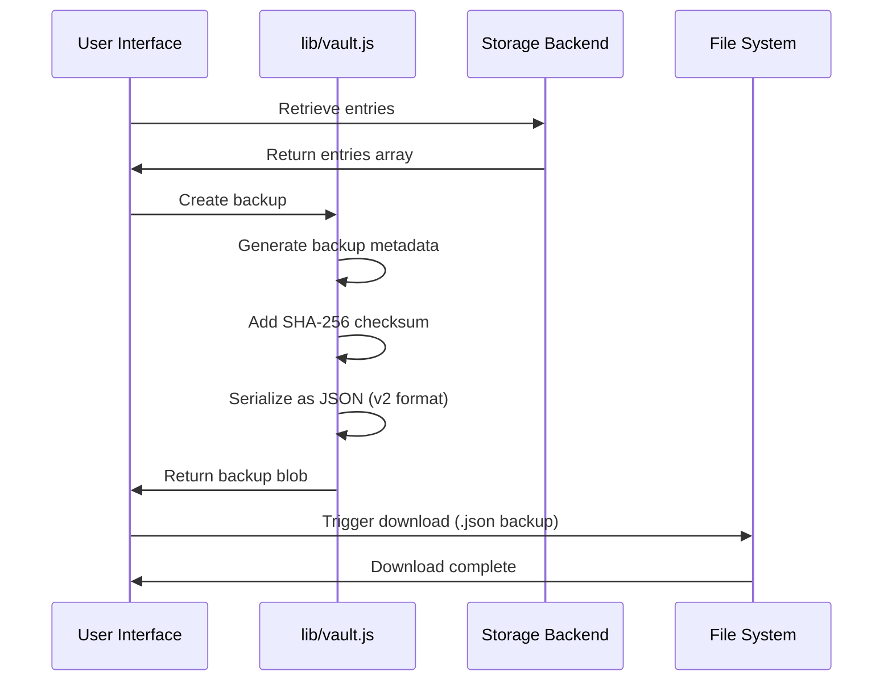

### Backup Import Flow
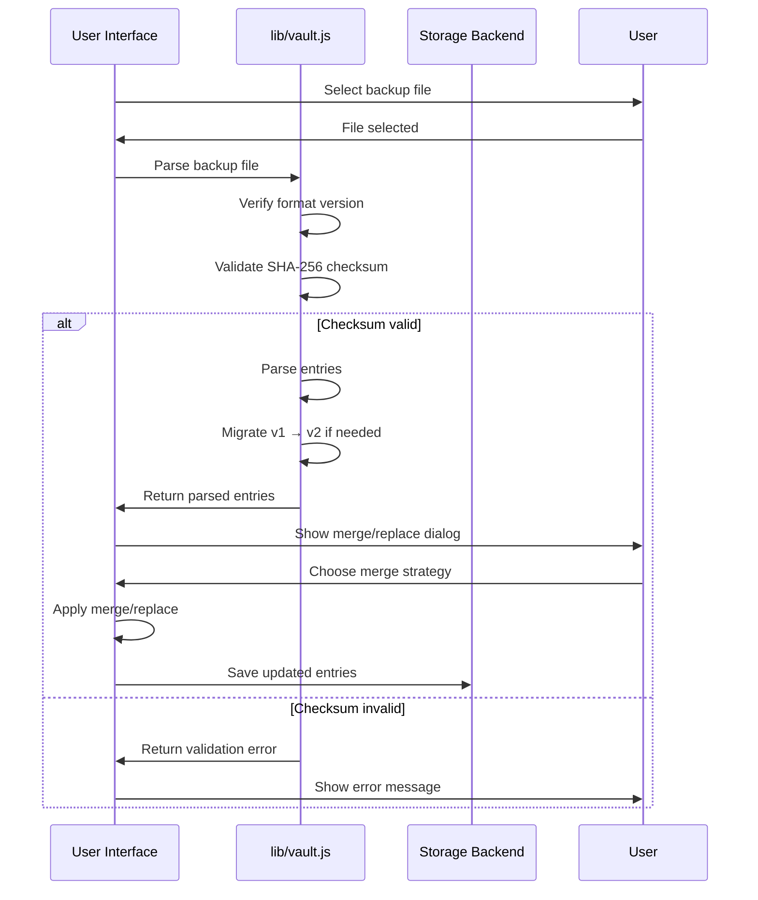

## Service Worker and Offline Architecture

### Service Worker Registration
See `sw.js` for the owning implementation (`CACHE_NAME`,
`APP_SHELL`). The cached app shell is the offline entry point; navigation
requests fall back to the cached `index.html`.

### PWA Installation Flow
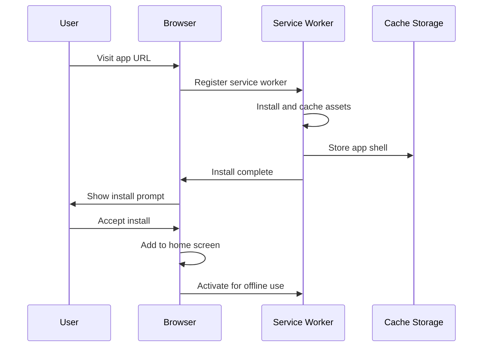

### Offline Operation
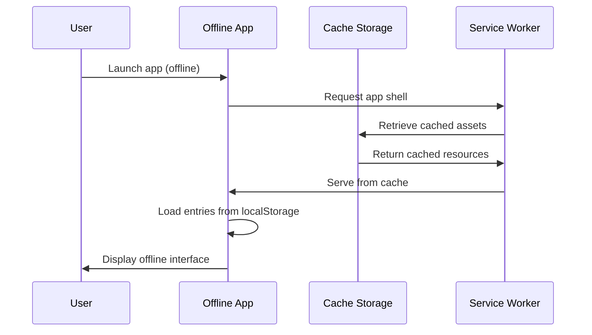

## Backup Format Versioning

### Version 2 Format (Current)
```json
{
  "version": 2,
  "encrypted": false,
  "createdAt": "2026-06-27T10:30:00.000Z",
  "itemCount": 1,
  "checksum": "abc123...",
  "payload": {
    "schemaVersion": 1,
    "entries": [
      {
        "id": "entry_1687854000_abc123",
        "label": "ExampleService:user@example.com",
        "secret": "JBSWY3DPEHPK3PXP",
        "digits": 6,
        "period": 30,
        "pinned": false,
        "tags": ["personal", "important"],
        "createdAt": 1687854000000
      }
    ]
  }
}
```

Encrypted backups keep the same envelope with `"encrypted": true`,
`"itemCount": 0`, and `payload: { "schemaVersion": 1, "vault": { salt, iv, data } }`.
See `buildBackupEnvelope` in `lib/vault.js` for the owning shape.

### Version 1 Migration
The system automatically detects and migrates v1 backups (see `migrateBackup` in `lib/vault.js`):
- **v1 backups**: No checksum; accepted as `"legacy"` integrity after strict entry-shape validation
- **v2 checksum**: SHA-256 hex of the serialized `payload` (no prefix)
- **Migration**: Automatic upgrade on import
- **Fallback**: Graceful error if migration fails

### Checksum Validation
See `parseBackupFile` in `lib/vault.js` for the owning logic:
- v2 backups must carry `checksum`; it is compared against `SHA-256(JSON.stringify(payload))`
- Purpose: detect tampering and corruption
- Validation: mandatory before import for v2 backups

## Entry Render Loop

### Display Update Cycle
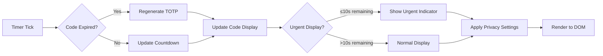

### Update Triggers
1. **Timer-based**: Every second for countdown updates
2. **Code regeneration**: When period expires
3. **User interaction**: Copy, pin, edit actions
4. **Data changes**: Add, remove, import operations
5. **View changes**: Group, sort, filter updates

## Storage Key Evolution

### Version Naming Convention
All storage keys follow the pattern: `{prefix}_{name}_v{version}`

### Root App Key Evolution
`personal_otp_vault_entries_v3` is the current entries key (Phase 3). The v3
store is authoritative; the legacy v2 key is retained read-only and only
consulted while v3 is absent (first load after the upgrade), so entries deleted
after migration cannot resurrect from v2.
```
personal_otp_vault_entries_v3 (current)
personal_otp_vault_entries_v2 (legacy, read-only fallback)

personal_otp_vault_encrypted_v1 (current; gains `kdf.mode: "dek-v1"` + `dek` block in biometric mode)

personal_otp_vault_settings_v3 (current; now also carries autoLockMinutes, timeDriftCheck, lastBackupAt/Hast, theme)

personal_otp_vault_biometric_v1 (biometric record: credentialId, prfSalt, wrappedDek, wrappedIv — non-secrets only)
personal_otp_vault_undo_tombstone_v1 (10-minute undo tombstone; encrypted when the vault is)
personal_otp_vault_unlock_guard_v1 (unlock throttling: attempts + lockedUntil)
personal_otp_vault_legacy_upgrade_hash (sessionStorage sentinel for the legacy re-encrypt)
```

### Extension Key Evolution
`otp_extension_entries_v3` is current with the same v3-authoritative/v2-fallback
semantics as the root app.
```
otp_extension_entries_v3 (current)
otp_extension_entries_v2 (legacy, read-only fallback)
otp_extension_entries_v1 (deprecated)

otp_extension_encrypted_v1 (current)

otp_extension_settings_v1 (current)
otp_extension_ui_v1 (current)
otp_extension_biometric_v1 (biometric record)
otp_extension_undo_tombstone_v1 (undo tombstone)
otp_extension_unlock_guard_v1 (unlock throttling)
otp_extension_session_unlock_v1 (chrome.storage.session cache: passphrase + CryptoKey handle, cleared on lock/idle/browser exit)
```

### Entry Schema v3
Entries carry `type` (`"totp"` | `"hotp"`), `algorithm` (`SHA1` | `SHA256` |
`SHA512`), `counter` (HOTP, incremented on reveal/copy), `order` (manual
reorder position), plus the existing id/label/secret/tags/digits/period/
pinned/createdAt fields. Pre-v3 entries migrate on first load; HOTP entries in
backups degrade to TOTP when restored into pre-0.1.3 versions.

## Extension Service Worker

### Background Script Role
See `extension/background.js` for the owning implementation: a minimal MV3
service worker that schedules an auto-lock alarm from the stored settings and
clears the `chrome.storage.session` unlock cache when the browser goes idle or
the alarm fires. The popup talks to storage directly via
`chrome.storage.local`/`chrome.storage.session`; there is no
popup-to-background message-passing layer.

## Error Handling Architecture

### Crypto Error Handling
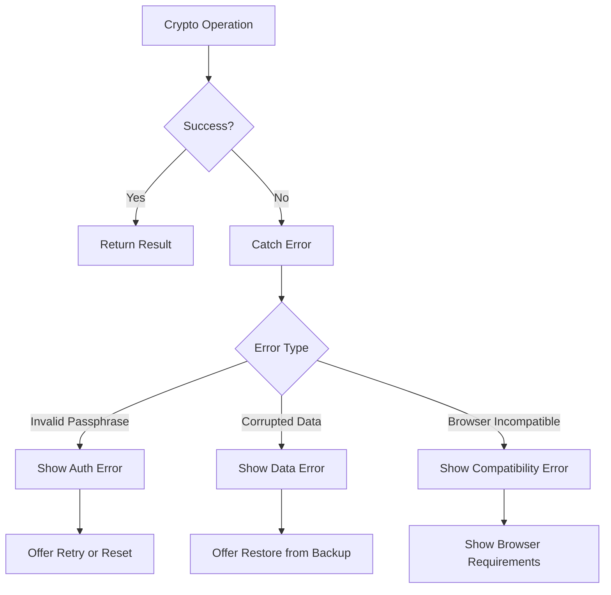

### Validation Error Handling
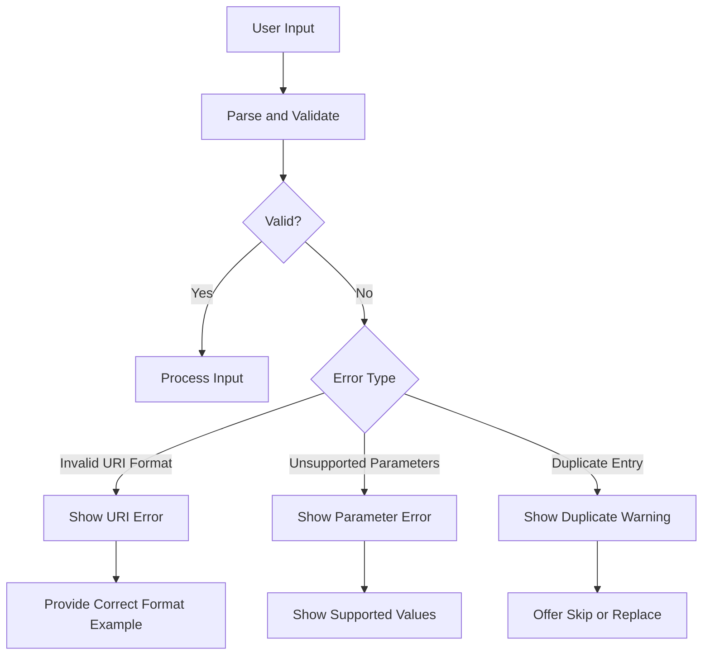

## Performance Considerations

### Caching Strategy
- **App shell**: Cache-first for instant loading
- **TOTP generation**: Computed on-demand, not cached
- **Entry display**: Direct DOM updates in `app.js`
- **Search indexing**: Pre-computed for fast filtering

### Memory Management
- **Entry limits**: No hard limit, but UI performance guides
- **Crypto operations**: Web Crypto uses native implementations
- **Service worker**: Controlled cache size with version management
- **Extension storage**: Chrome manages quota automatically

## Security Architecture

### Threat Model
- **Trusted device**: Assumes user controls their device
- **Local-only**: No network transmission of secrets
- **Encryption optional**: Users choose security vs convenience
- **Backup safety**: Checksum validation prevents tampering

### Security Boundaries
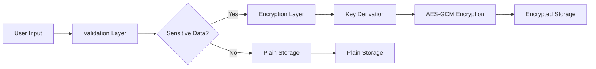

### Web Crypto Usage
- **No external crypto**: Only Web Crypto API
- **Browser native**: Uses browser's crypto implementations
- **Proper algorithms**: Follows current best practices
- **Fallback handling**: Graceful degradation if unsupported

## Integration Points

### Root App Integrations
- **PWA install**: Uses browser install prompts
- **Camera access**: Requests permissions for QR scanning
- **File system**: Backup export/import via downloads
- **Clipboard**: Read/write for code copying and URI import

### Extension Integrations
- **Chrome storage**: Async storage API with quota management
- **BarcodeDetector**: For QR code parsing in extension
- **Clipboard API**: Same as web app for consistency
- **Extension pages**: Popup and background service worker

This architecture enables the Personal OTP Vault to function as both a full-featured PWA and a lightweight browser extension while sharing core domain logic and maintaining clear separation of concerns.
